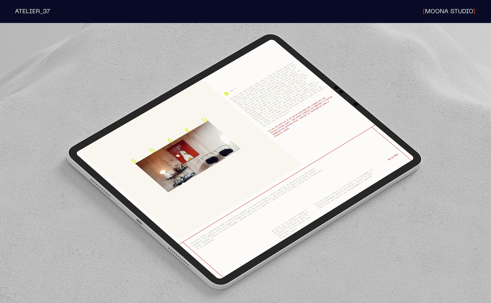
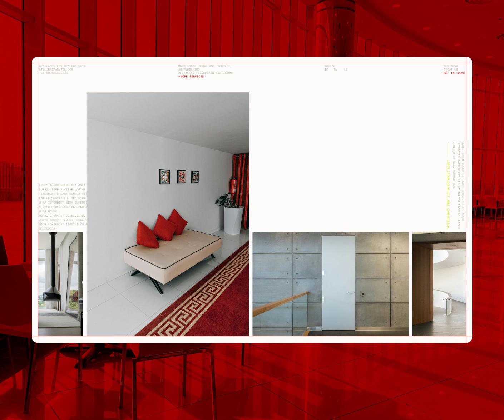
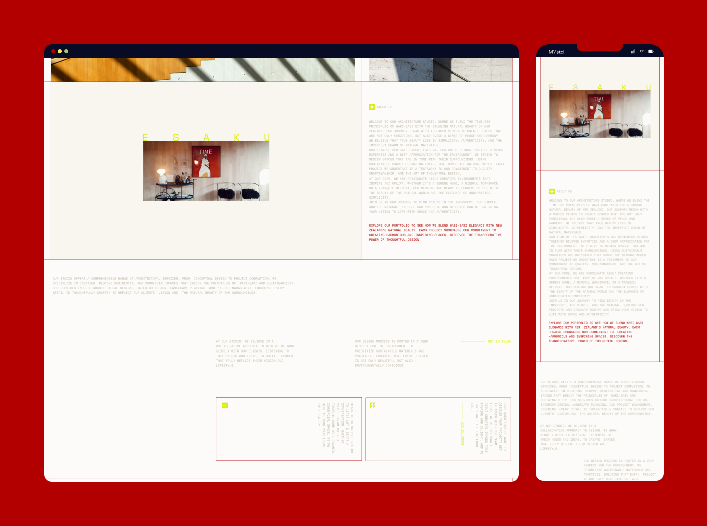
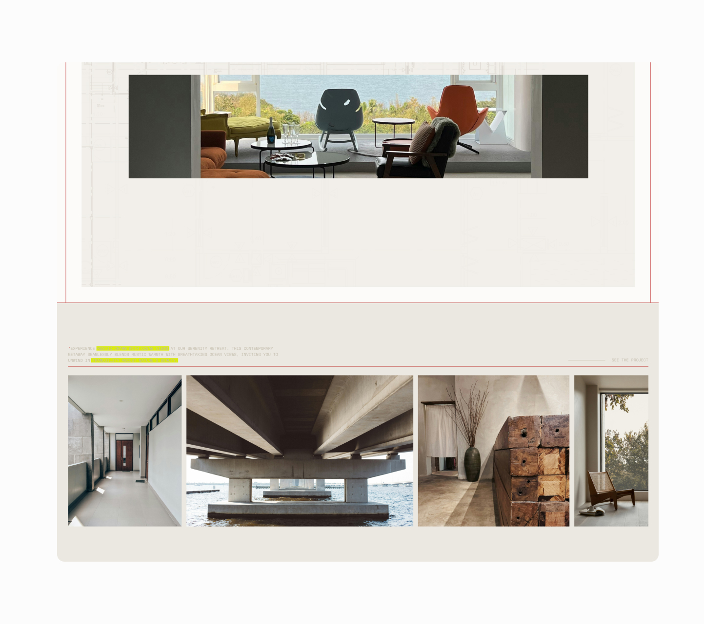
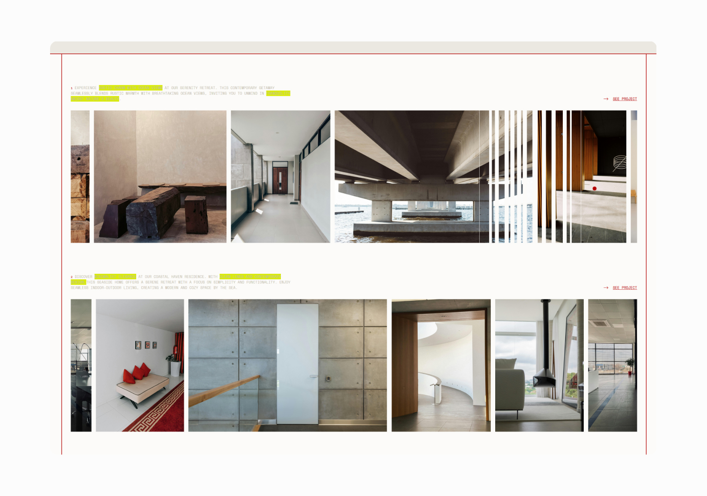

# Atelier37

Our A37 Project website embodies the serene beauty of wabi-sabi with a Japanese aesthetic. Inspired by traditional Japanese bookbinding, the site features clean lines, subtle textures, and an intuitive design, offering a tranquil and engaging user experience.

See full project here: https://atelier37.moona.dev/

You can reach us at: std.moona@gmail.com

